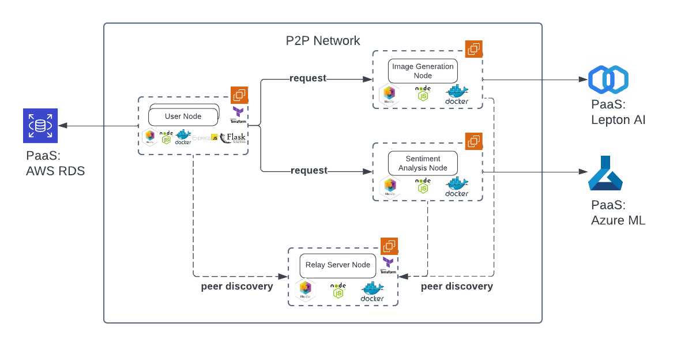

# aws-p2p-ml-svcs

A peer-2-peer platform that provides users with machine learning services such as image generation and text generation.

## Architecture

## How to Run

### 1. relay-server

Go to `relay-server` and deploy the relay server on AWS EC2 instance. Relay server has to be deployed first so that peers (user and service nodes) can discover each other through it.

### 2-1. ml-img–gen-node (powered by Lepton AI)

Go to `ml-img-gen-node` and run the service node locally.

### 2-2. ml-txt-gen-node (powered by Azure ML)

Go to `ml-txt-gen-node` and run the service node locally.

### 3. user-node

Go to `user-node` and run the user node locally.

## Demo

Access the endpoint (not the localhost one) shown in the terminal output after starting user-node.
